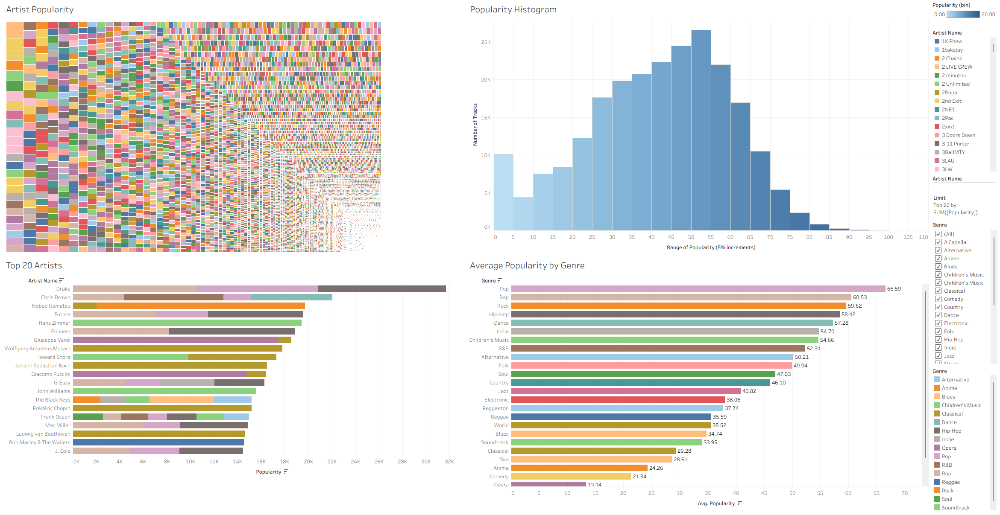
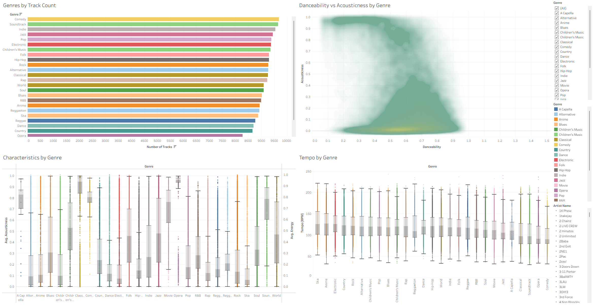
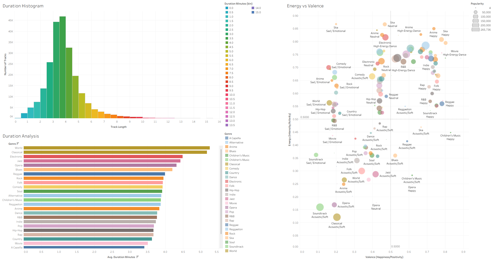

# Spotify Streaming Trends (Tableau Analysis)

**Repository name:** `spotify-streaming-trends-tableau`  
**Description:** Exploratory analysis of Spotify streaming data using Tableau, focusing on artist performance, track popularity, and listening trends.

---

## Overview

This repository contains a Tableau workbook analysing Spotify streaming data.  
The project focuses on exploratory data analysis and dashboard design, using Tableau to surface patterns and trends in music streaming behaviour.
## Popularity Metrics Dashboard

## Audio & Genre Characteristics

## Track Behaviour & Listening Patterns

All analysis is contained within a single Tableau Packaged Workbook (`.twbx`), including the dataset, worksheets, and dashboards.

---

## Objectives

- Explore overall streaming trends
- Identify high-performing artists and tracks
- Compare popularity across genres and time periods
- Present insights using interactive Tableau dashboards

---

## Task Expectations

The original task required:

- Importing a Spotify dataset into Tableau  
- Creating multiple worksheets to explore the data  
- Applying appropriate aggregations, sorting, and filters  
- Combining worksheets into a clear, interactive dashboard  

The focus was on insight generation and visual communication rather than advanced modelling.

---

## What This Project Includes

- Cleaned and structured data within Tableau  
- Multiple analytical worksheets  
- Interactive filters for exploration  
- One or more dashboards designed for clarity and usability  
- Clear titles, labels, and tooltips to support interpretation  

---

## Tools Used

- Tableau Desktop / Tableau Public  
- Exploratory Data Analysis (EDA)  
- Dashboard design and data visualisation  

---

## Repository Structure
spotify-streaming-trends-tableau/
│
├── Tableau/
│ └── SpotifyWB.twbx
│
└── README.md

---

## How to View

1. Download or clone the repository  
2. Open `SpotifyWB.twbx` in Tableau Desktop or Tableau Public  
3. Explore the worksheets and dashboards interactively  

---

## Notes

- The `.twbx` format bundles the data and visuals for portability  
- All analysis logic is implemented directly in Tableau  
- This project prioritises clarity, exploration, and presentation
